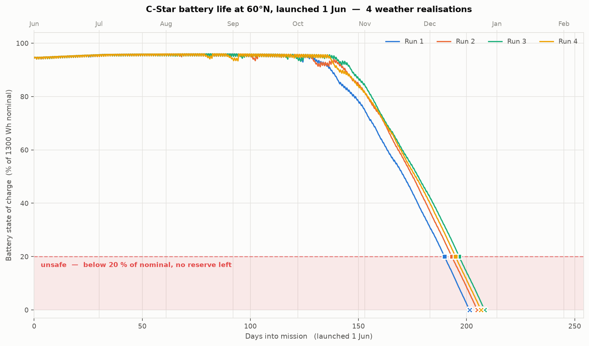
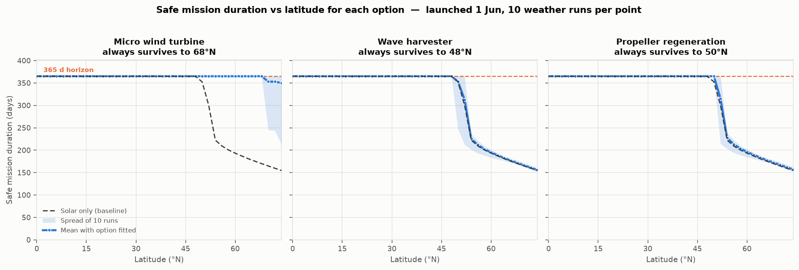

# Alternative Power for C-Star at High Latitude

## 1. Sizing the problem

A customer wants to operate C-Stars at high latitude, where solar power may be limited. Before
comparing harvesters I modelled the baseline vehicle, because "would this help?" has no answer
until you know how large the deficit is and *when* it falls.

The model tracks battery state of charge hour by hour over a year. What it predicts depends
mainly on **latitude, time of year, cloud, wind and sea temperature**: sun angle and day length
set how much light reaches a flat deck panel, cloud and sail shading remove more, and cold water
quietly reduces usable battery capacity. Cloud and wind are generated as *persistent* random
series, so bad spells last days rather than averaging out — which is what actually threatens a
vehicle. This is a sizing tool, not a truth machine: it is only as good as its assumptions
(§4), it should be improved before any hardware commitment, and **it is no substitute for real
sea trials.**

**Safe mission duration** here means time from launch until the battery first falls below 20 % of
nominal — not failure, but the point at which no reserve remains for a storm or a bad weather run.
All runs assume a **1 June launch**: it exercises a full seasonal cycle and is the most favourable
date, so every failure shown is a genuine capability limit rather than bad timing.

The figure shows four runs at 60 °N. Through summer the battery sits near full and surplus is
simply dumped; from late September it falls away, and the vehicle becomes unsafe after **190–197
days**. The runs differ only slightly because at this latitude the answer is set by sun geometry,
not weather luck — predictable, but with no good year to hope for.

**The problem is darkness, not energy.** At 65 °N the array generates 15.0 kWh a year against an
8.8 kWh load — a 1.7× surplus — and the vehicle still dies, because the energy arrives in the wrong
months. December generation is 0.1 Wh/day against 24 Wh/day consumed, roughly one-thousandth of
July. Day length collapses, a low sun striking a flat deck loses most of its energy to the cosine
of the incidence angle, and the beam crosses far more atmosphere. This is a **seasonal storage
problem**, so a useful solution must deliver *in the dark months specifically*.

Sweeping latitude, every run survives the full year up to **48 °N**; 50–52 °N is a knife edge where
some weather years survive and some do not; **from 54 °N upward every run fails.** The sweep stops
at 74 °N: beyond ~75 °N the Arctic is ice-covered, a 1 m sailing hull cannot operate in ice, and the
model has no ice physics. Ice also damps waves, which matters below.

**The requirement.** Solving for the constant extra generation that removes every blackout gives
**0.25 W at 65 °N and 0.48 W at 70 °N** — 25–50 % of the vehicle load. If C-Stars are to run
**propeller-driven** at any point in a mission, that draw is far larger than the 1 W housekeeping
load, so we should aim to **exceed** this figure with real margin rather than just meet it.

**The goal.** More endurance is always useful, but the ideal is that a C-Star **survives the whole
winter**: reaching spring with charge in hand returns it to surplus conditions, so it can keep
going — bounded then by battery calendar life, biofouling and equipment failure rather than by the
energy balance. Options that fall short still have value; options that clear the winter change what
missions are possible.

---

## 2. The options

**From the brief:** a small wind turbine and a wave-energy harvester. **Added for completeness:** a
larger battery and propeller regeneration. I added these because any recommendation to spend money
on new hardware has to beat the cheap alternatives first — more cells need no new technology at
all, and the propeller is already fitted, so both are the obvious objections a reviewer would raise.

**A larger battery — fails on mass.** *(added)* Capacity buys endurance linearly at 3.9 days per kg,
so there is no efficiency argument against it. But the pack needed to clear winter scales badly:
**3640 Wh at 60 °N (+21 kg, 53 % of vehicle mass), 4680 Wh at 65 °N (+31 kg, 77 %), 6500 Wh at
70 °N (+47 kg, 118 %).** At 70 °N the cells alone outweigh the complete vehicle — not a modification
but a different boat. It is a reasonable answer for the marginal 50–52 °N band and nothing beyond,
and it adds no generation: it enlarges the tank without addressing what fills it in December.

**A wave-energy harvester — falls short by ~20×.** *(from the brief)* A 1 m hull is far shorter than
an ocean wavelength (50–150 m), so it is a *wave follower* — it rides the surface, leaving no
hull-to-water relative motion to exploit. Power can then only come from an internal proof mass
reacting against the hull's own motion, and is proportional to the stroke available, of which a 1 m
hull has very little. Modelled with a 2 kg mass and 60 mm of stroke, mean output is **0.023 W**,
about 2 % of the load. Reaching 0.5 W would need roughly a 5 kg mass moving 0.5 m inside a 1 m
vehicle. **This is a scale problem, not a maturity problem.**

More imaginative geometries do escape the wave-follower trap by reaching outside the hull — a
**tethered submerged body** (a drogue, plate or small buoy) held deep enough to sit in slower water,
so the hull moves relative to it and the tether does work; or a towed flexible membrane. These are
genuinely promising in principle and are how the concept would have to be done. I have not
assessed them here because they add a deployed external line, a winch or damper, and a large
snag, chafe and entanglement risk on an unattended year-long mission — high complexity for a
platform whose main virtue is that nothing hangs off it. **With a longer programme they arguably
deserve assessment**, and I would not close the door on wave energy purely on the internal-mass result.

**Propeller regeneration — self-limiting.** *(added)* Let the existing propeller freewheel and run
the motor as a generator. Water is 830× denser than air, so a small disc looks promising. But
Oshen's propeller has ~2–3 cm blades, and at a 1.5 kn sailing speed mean output is **0.044 W**,
far below requirement, while the turbine still costs **14 % of boat speed** (1.50 → 1.29 kn). It
cannot be scaled out of: the energy comes from the boat's motion, so a larger disc slows the boat,
and power falls with the cube of speed. Output saturates around 0.17 W while the speed penalty
grows without limit. Worth enabling opportunistically since it is nearly free, but not a solution.

**A micro wind turbine — works, with margin.** *(from the brief)* Ocean wind rises with latitude and
**peaks in midwinter**, in direct antiphase with the sun — the physical basis of the concept. A
0.20 m rotor with a 3 m/s cut-in, furling in survival winds, gives **2.6 W at 60 °N and 3.1 W at
70 °N** — five to ten times requirement and 2–3× the whole vehicle load, with genuine headroom for
propeller-driven operation. Output is reduced by the **atmospheric boundary layer**: wind is quoted
at 10 m, but a hub about 1 m above a sea surface that is slowing the flow by friction sees roughly
22 % less.

Compared side by side, only the wind turbine moves the curve: it survives to **68 °N** against 48 °N
for solar alone. The wave and propeller traces sit almost exactly on the baseline.

---

## 3. Recommendation, integration and testing

**Recommend the wind turbine.** It is the only option meeting the requirement with margin, the only
one working beyond ~50 °N, and the only one leaving enough headroom to use propeller drive.

**Integration is the hard part, not the power.** A rotating machine competes for masthead space with
a *rotating wingsail* — a geometric and aerodynamic clash; mass and windage go high up, attacking
righting moment on a 40 kg hull; it adds the vehicle's first exposed bearing, in salt spray,
unattended for a year; it must survive knockdown and immersion; and **icing, at exactly the
latitudes where it is most needed, is the largest unquantified risk.** My starting concept is a
stern-mounted pylon rather than masthead, accepting lower wind speed to stay clear of the sail and
keep the CG down, feeding the existing MPPT input through a rectifier.

**De-risking, cheapest and most decisive first.** Each test is designed to *kill* the concept early:

1. **Fix the input data (days, ~£0).** Replace the synthetic cloud and wind climatology with ERA5 /
   NASA POWER reanalysis for the customer's real operating box and re-run. Every number here moves.
2. **Instrument a hull already going to sea (weeks, low cost).** IMU, GPS speed and panel current —
   retiring three assumptions at once: the acceleration spectrum settles wave, the speed
   distribution settles regeneration, panel current gives real shading loss.
3. **Wind-tunnel or CFD the sail–rotor interaction (~3 weeks).** The question that decides whether
   the concept is integrable at all.
4. **Bench-test a candidate rotor (~2 weeks)**, then **cold-soak and ice test** it — the risk most
   likely to be found too late.
5. **Sea trial as a data logger, not a mission (~1 month).** One vehicle, everything logged, on a
   recoverable route. No customer mission until a full seasonal dataset exists.

**Two months vs six.** With **two months** the goal is a *decision*, not a prototype: steps 1–4 plus
a deliberately non-flight-representative lash-up — an off-the-shelf marine turbine on a stern pylon,
logged in sheltered water. The deliverable is a measured power curve and a defensible answer on sail
interaction. With **six months** the first two are unchanged — those tests are on the critical path
either way. The extra four buy a sealed, bearing-life-tested installation, the icing and knockdown
survival campaign, a winter deployment above 60 °N validating the model against reality, and
re-qualification of stability with mass aloft — plus enough room to assess a tethered wave harvester
properly. The distinction matters: **the two-month plan is not a compressed six-month plan.** It
drops qualification and buys a decision rather than a product.

**Next step.** Two weeks of reanalysis data and one instrumented deployment — a few hundred pounds —
would firm up every number here before any hardware commitment.

---

## 4. Assumptions and limitations

The model is a screening tool. Its main limitations: cloud and wind come from latitude
correlations rather than measured data; there is no sea-ice, storm-survival or biofouling model;
the vehicle is assumed to hold a fixed load with no adaptive power management; wave power is
assessed only for an internal proof mass; and drag, stability and seakeeping effects of any added
hardware are outside it. It predicts *relative* differences between options far better than
absolute endurance, and **no version of it replaces a winter at sea.**

| # | Assumption | Why it matters | To firm up |
|---|---|---|---|
| `A9` | Cloud from a latitude correlation | Sets the entire solar deficit | ERA5 / PVGIS for the real box |
| `A17` | Wind climatology, winter peak | The whole case for wind | ERA5 reanalysis |
| `A21` | Wave stroke and proof mass | Decides a 20× shortfall | IMU on a hull at sea |
| `A23` | 1.5 kn sailing speed | Regen power scales as speed cubed | GPS traces from real missions |
| `A24` | ~5 cm propeller disc; output peaks near 0.17 W at ~10 cm before drag losses overtake it | Bounds regeneration at any size | Tow tank: power and drag together |
| `A2` | Panels flat on deck | Low-sun cosine loss is punishing | CAD; check for usable vertical area |

Two further assumptions bound the study and should be confirmed with Oshen: that **no additional
solar area is available**, and that **average consumption cannot be reduced below 1 W**. Since the
deficit is measured in tenths of a watt, both are disproportionately powerful levers — a winter
duty-cycle reduction may well be cheaper than any hardware considered here.

*Supporting work: `cstar_power_model.py`, `run_mission.py`, `sweep_latitude.py`, `sweep_battery.py`,
`sweep_compare.py`.*
