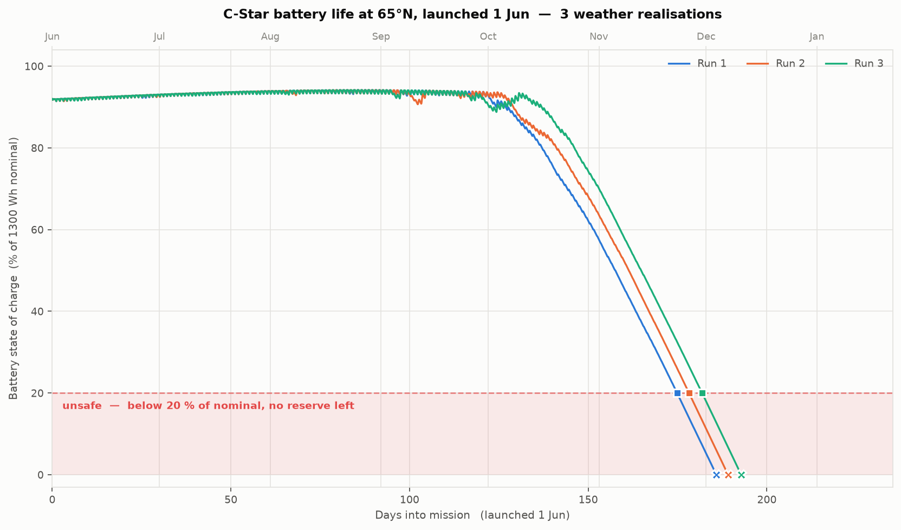

# Alternative Power for C-Star at High Latitude

**Part 1 — Sizing the problem**

---

## 1. Why build a model first

The customer's question is whether a wind turbine or a wave harvester would "meaningfully
improve endurance". That cannot be answered without first knowing how large the shortfall
is, when it occurs, and how far north it starts to bite. A harvester that delivers 2 W in
July is worthless if the deficit is in December.

I therefore built a time-domain power-budget model of the baseline vehicle before looking at
any harvester hardware. It runs an hourly energy balance over a full year and tracks battery
state of charge, taking latitude and launch date as inputs. It models solar geometry
(declination, hour angle, elevation — so day length and polar night fall out for free),
atmospheric attenuation via air mass, the cosine loss of a low sun onto a deck-mounted panel,
persistent stochastic cloud, sail shading, and a battery with temperature-dependent usable
capacity, a sub-zero charge inhibit, and calendar and cycle ageing.

The model is deliberately simple — it is a sizing tool, not a design tool. Its value is that
it converts a vague worry into a number in watts that any candidate solution must beat, and
it makes every assumption explicit and swappable. Sixteen assumptions are labelled `A1`–`A16`
in the source with a note on what it would take to firm each one up. The single most
important data gap is the cloud model (`A9`), which is currently a latitude correlation
rather than measured irradiance; replacing it with NASA POWER or PVGIS data for the
customer's actual operating box is the first thing I would do with more time.

Throughout, "safe mission duration" means the time from launch until the battery first falls
below 20 % of nominal capacity. That is not the point of failure — it is the point at which
there is no longer any reserve for a storm, a missed comms window or a bad run of weather,
and a mission planner should already be recovering the vehicle.

---

## 2. A single mission, and why no two are identical

The figure above shows three runs of the same vehicle at 65 °N, launched 1 June. The shape is
the whole problem in one picture. Through the northern summer the battery sits pinned near
full — the array generates far more than the vehicle can use or store, and the surplus is
simply dumped. From late September the trace begins to fall, the decline steepens through
November, and the vehicle enters the unsafe band after **175–182 days** and is flat about ten
days later.

The three traces differ because the model's cloud cover is stochastic. Cloud is generated as
an AR(1) process rather than as independent daily noise, so overcast arrives in multi-day
spells the way real weather does. That persistence matters: what threatens the vehicle is not
an averagely cloudy winter but a fortnight of unbroken overcast arriving when the sun is
already low, and a model that drew each day independently would understate that risk badly.

What is striking is how *little* the runs differ — a spread of 7 days on a 178-day mean
(σ ≈ 3.5 d). At this latitude the answer is set by orbital geometry, not by weather luck. That
is good news for mission planning, because the endurance figure is repeatable and can be
quoted with confidence. It is also bad news for optimism: there is no good year to hope for.

---

## 3. The problem is darkness, not energy

It would be easy to assume the array is simply undersized. It is not. Over a full year at
65 °N the array generates **15.0 kWh against a 8.8 kWh load — a 1.7× surplus.** The vehicle
still fails, because that energy arrives in entirely the wrong months:

| Month at 65 °N | Jul | Sep | Oct | Nov | Dec |
|---|---|---|---|---|---|
| Generation (Wh/day) | 103.7 | 40.7 | 15.6 | 2.6 | **0.1** |
| Consumption (Wh/day) | 24.0 | 24.0 | 24.0 | 24.0 | 24.0 |
| Peak sun elevation | 46° | 27° | 15° | 6° | **1.9°** |

December generation is roughly **one thousandth** of July's. Three separate penalties compound,
all of them consequences of a low sun, and it is worth separating them because they are often
conflated:

1. **Day length collapses.** Above the Arctic Circle the sun does not rise at all for part of
   the year, and well below it the useful window shrinks to a couple of hours.
2. **Cosine loss.** The panels lie flat on the deck, so the light they capture scales with the
   sine of the sun's elevation. At 1.9° that factor is 0.03 — 97 % of the available light is
   lost to geometry before any other effect is considered.
3. **Atmospheric path.** A low sun's beam crosses roughly ten atmospheres rather than one, and
   most of it is absorbed before reaching the sea surface.

Two smaller effects push the same way: high latitudes are persistently cloudier, and cold water
derates usable battery capacity by around 6 %, so the store you are drawing down is smaller than
its nameplate. (One effect works in the vehicle's favour — cold panels are about 5 % *more*
efficient than at 25 °C. It is nowhere near enough to matter.)

**This is a seasonal storage problem, not an energy problem.** That framing matters, because it
changes what a good solution looks like: the requirement is not more annual energy but a source
that delivers *during the dark months specifically*.

---

## 4. Why the margin is worth more than survival

Endurance is not the only thing at stake. C-Star also operates in driven mode, using a
propeller for station-keeping, punching through calms, holding a precise survey line, or
manoeuvring for recovery. Driven mode draws far more than the 1 W housekeeping load.

An operator will only use that capability if they can trust the vehicle to recharge afterwards.
At high latitude in winter, on the current design, they cannot — a driven-mode excursion in
November is drawn directly out of a reserve that has no way of being replenished before spring.
The practical consequence is that the vehicle is not merely at risk of dying; it is degraded to
a passive drifter precisely in the conditions where active control is most valuable.

Any additional power source should therefore be judged on two counts: whether it keeps the
vehicle alive, and whether it restores enough margin to make driven mode usable. The second is
the more demanding requirement and, commercially, probably the more valuable one.

---

## 5. Where the design stops working

Sweeping latitude from the equator northwards at 2° intervals, with ten weather realisations at
each, gives the envelope above. Launched on 1 June:

- **Up to 48 °N** every run survives the full 365-day horizon. These points sit on the dashed
  line because the simulation stopped, not because the vehicle failed — the true endurance
  there is unbounded.
- **50–52 °N is a knife edge.** At 50 °N nine of ten runs survive the year and one fails at
  239 days; at 52 °N only five of ten survive. The variance in this band is two orders of
  magnitude larger than anywhere else, and the mean is close to meaningless — the same vehicle
  either makes it through the winter or does not, depending only on the weather it happens to
  draw.
- **From 54 °N upwards every run fails**, and the curve then falls smoothly from 222 days at
  54 °N to 155 days at 74 °N.

Two features of that curve are worth drawing out. First, the fall-off is steep at the
transition and then shallow: once the vehicle is guaranteed to lose the winter, going further
north costs surprisingly little extra, because it is already generating essentially nothing
in December either way. Second, the spread between best and worst run narrows sharply with
latitude — from 34 days at 54 °N to around 9 days at 66 °N. The far north is harsher but far
more predictable.

One further lever is visible only by comparison. The same vehicle at 65 °N launched on
**1 October** survives just 61 days, against 178 days launched in June. Launch timing is worth
a factor of three in endurance and costs nothing, and it should be exhausted as a mitigation
before any hardware is considered.

---

## 6. Summary, and the options on the table

**The problem.** The baseline C-Star is comfortably self-sufficient across most of the world's
oceans. Its solar array generates a healthy annual surplus even at 65 °N. What it cannot do is
carry energy from the summer, when it wastes most of what it collects, into the winter, when it
collects almost none. The result is a hard geographic and seasonal boundary on where the
vehicle can be deployed.

**Where there is nothing to worry about.** Below roughly 48 °N — which covers the great majority
of commercial ocean operations — no intervention is needed at all, in any season, and the
vehicle will run indefinitely. Between **50 and 52 °N** the design becomes marginal and
outcomes turn on luck; this band should be treated as requiring case-by-case assessment rather
than a blanket yes or no. **Above about 54 °N the current design cannot complete a year**, and
this is where the customer's question genuinely bites.

**The two options in the brief.** A **small wind turbine** is attractive because the high-latitude
winter that removes the sun is also windy, so supply and demand are seasonally in phase; the
questions are how much power is available at the scale of a 1 m, 40 kg sailing hull, and what
it costs in drag, mass aloft and reliability. A **wave-energy harvester** shares the same
favourable seasonal correlation — winter seas are the biggest — and has no exposed rotating
machinery above the waterline, but extracting useful power from the motion of a very small hull
is a harder physical problem. Both are assessed in Part 2 against the requirement derived here.

**Other options considered for completeness.** Any recommendation has to beat the boring
alternatives, so two further options are carried through the comparison: simply fitting a
**larger battery**, which needs no new technology but costs mass on a 40 kg vehicle; and
**re-using the existing propeller as a water turbine** while under sail, which adds no new
external hardware at all and exploits the fact that the vehicle is already moving through the
water for most of its mission.

**Assumptions bounding this study.** Two obvious levers are excluded by assumption, and both
should be confirmed with Oshen before the study is relied upon:

- **No additional solar area is available.** The deck and wingsail are assumed to be fully
  utilised at 50 W peak. If usable area does exist — particularly on near-vertical surfaces,
  which perform far better than a flat deck under a low sun — that would change the analysis
  substantially and should be checked first.
- **Average electrical consumption cannot be reduced below 1 W.** Given that the deficit is
  measured in tenths of a watt, even a modest saving in winter duty cycle would be a
  disproportionately effective mitigation, so this assumption is worth challenging directly.

---

*Supporting work: `cstar_power_model.py` (the model, with assumptions `A1`–`A16` documented
inline), `run_mission.py` (single-mission runs), `sweep_latitude.py` (the latitude envelope).*
