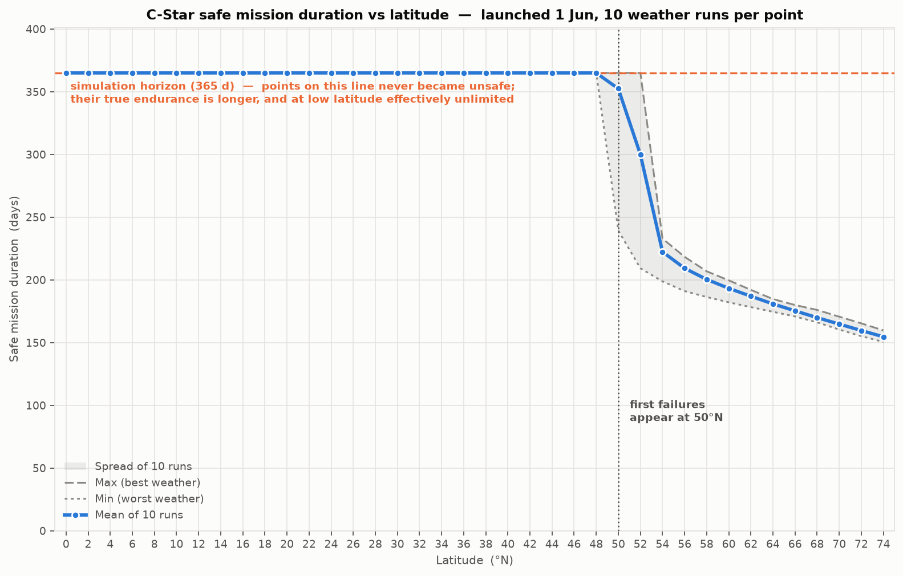
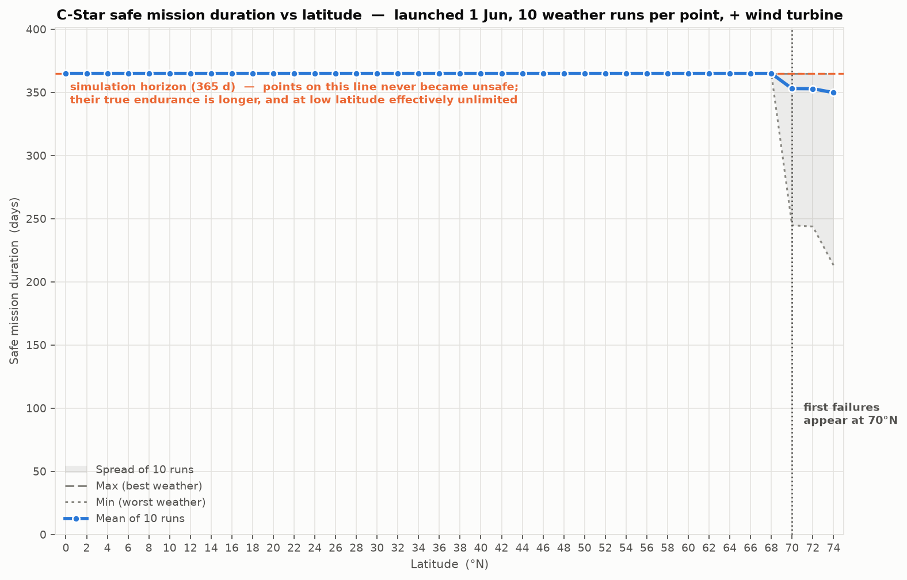

# Alternative Power for C-Star at High Latitude

**Recommendation:** fit a micro wind turbine. Wave energy falls short by ~20x and should be closed
out; propeller regeneration is self-limiting and cannot close the gap; a larger battery costs more
mass than the vehicle can carry.

---

## 1. Sizing the problem

I modelled the baseline vehicle before looking at any harvester, because "would this help?" has no
answer until you know how large the deficit is and *when* it occurs. The model runs an hourly energy
balance over a year: solar geometry (so day length and polar night emerge naturally), Kasten–Young
air mass, the cosine loss of a low sun onto a deck panel, persistent stochastic cloud, sail shading,
and a battery with temperature-derated capacity, a sub-zero charge inhibit and ageing. All
assumptions are labelled `A1`–`A25` inline in `cstar_power_model.py` with a note on firming each up.

**Safe mission duration** means time from launch until the battery first falls below 20 % of
nominal — not failure, but the point at which no reserve remains for a storm or a bad weather run.
All runs assume a **1 June launch**: it exercises a full seasonal cycle, it is the most favourable
date so every failure is a genuine capability limit, and a vehicle reaching spring with charge in
hand returns to surplus conditions and can then run indefinitely.

**The problem is darkness, not energy.** At 65 °N the array generates 15.0 kWh a year against an
8.8 kWh load — a 1.7x surplus — and the vehicle still dies, because that energy arrives in the wrong
months. December generation is 0.1 Wh/day against 24 Wh/day consumed — one-thousandth of July.
Three effects compound, all from low sun: day length collapses; the flat deck panel suffers a cosine
loss (at a 1.9° sun, 97 % of available light is lost to geometry alone); and the beam crosses ten
atmospheres instead of one. This is a **seasonal storage problem**, so a useful solution must deliver
*in the dark months specifically*, not on annual average.

Sweeping latitude at 2° intervals with ten weather realisations each: **every run survives the full
year up to 48 °N**; 50–52 °N is a knife edge where variance is two orders of magnitude higher than
elsewhere and the mean is meaningless; **from 54 °N upward every run fails.** Above 54 °N the spread
between best and worst run is only 9–34 days, so endurance is set by orbital geometry rather than
weather luck — predictable, but with no good year to hope for.

The sweep stops at 74 °N: beyond ~75 °N the Arctic basin is ice-covered, a 1 m sailing hull cannot
operate in ice, and the model has no ice physics. Ice also damps the wave field, which matters below.

**The requirement.** Bisecting on constant added generation until every blackout disappears gives
**0.25 W at 65 °N and 0.48 W at 70 °N** — 25–50 % of the total vehicle load. That is the target.

**The goal.** C-Star's value is long-duration autonomy, so the bar is binary rather than
incremental: a solution must carry the vehicle **through the winter**, because surviving one winter
implies surviving any number. Extending endurance from 193 to 250 days does not solve the problem;
it defers it and still ends with a dead vehicle. Options are judged on that test alone.

C-Star also operates in driven mode under propeller, and an operator will only use that capability
if they can trust the vehicle to recharge — so a solution that merely scrapes through winter is
worth much less than one restoring usable margin.

---

## 2. The four options

**A larger battery — fails on mass.** Below the survival threshold, capacity buys endurance
*linearly* at 3.9 days per kg (R² = 0.9996), so there is no efficiency argument against it. But the
pack needed to clear winter scales badly: **3640 Wh at 60 °N (+21 kg, 53 % of vehicle mass), 4680 Wh
at 65 °N (+31 kg, 77 %), 6500 Wh at 70 °N (+47 kg, 118 %).** At 70 °N the cells alone outweigh the
complete vehicle — not a modification but a different vehicle. It is the right answer for the
marginal 50–52 °N band and nothing beyond, and it adds no generation: it enlarges the tank without
addressing the fact that nothing fills it in December.

**A wave-energy harvester — fails by ~20x.** A 1 m hull is far shorter than an ocean wavelength
(50–150 m), so it is a *wave follower*: it rides the surface, leaving no hull-to-water relative
motion to exploit. Power can only come from an internal proof mass reacting against the hull's own
acceleration — `a = w^2·Hs/2`, energy per half-cycle `~ 2·m·a·s`. With a 2 kg mass, 60 mm of usable
stroke and 50 % PTO efficiency, mean output is **0.023 W**, ~2 % of the load, and the latitude curve
is indistinguishable from solar alone. Power is proportional to stroke, and reaching 0.5 W would need
a 5 kg mass moving 0.5 m inside a 1 m vehicle. **This is a scale problem, not a maturity problem** —
no PTO refinement recovers a factor of twenty. Recommend closing it out.

**Propeller regeneration — self-limiting.** Attractive because it adds no external hardware: let the
existing propeller freewheel and run the motor as a generator. Water is 830x denser than air, so a
small disc looks promising. But Oshen's propeller has ~2–3 cm blades, giving a ~5 cm swept disc, and
power scales with diameter *squared*. At a 2 kn maximum boat speed, mean output is **0.10 W** —
below the 0.25 W requirement — and the turbine costs **14 % of boat speed** (2.00 kn to 1.72 kn),
computed from the equilibrium of hull and turbine drag, both of which scale as v².

Crucially, **you cannot scale out of this.** The extracted power comes from the boat's kinetic
energy, so a bigger disc slows the boat, and power goes as v³:

| Disc diameter | 5 cm | 8 cm | 10 cm | 12 cm | 15 cm |
|---|---|---|---|---|---|
| Mean output | 0.100 W | 0.154 W | 0.169 W | 0.173 W | 0.167 W |
| Speed loss | 14 % | 28 % | 36 % | 43 % | 51 % |

Output saturates near **0.17 W** and then declines while the speed penalty grows without limit. The
concept is self-limiting below requirement, extending survival only from 48 °N to 50 °N. It remains
worth enabling opportunistically — it is nearly free — but it is not a solution.

**A micro wind turbine — works, with margin.** A 0.20 m rotor, `P = ½rho·A·Cp·eta·v³`, 3 m/s cut-in,
12 W rating, furling at 25 m/s. Ocean wind rises with latitude and **peaks in midwinter**, in direct
antiphase with the sun — the physical basis of the concept. Wind is a persistent AR(1) daily series,
shear-corrected from 10 m to a ~1 m hub (costing ~22 %), with the cubic evaluated hourly because
E[v³] is roughly twice E[v]³. Mean output is **2.6 W at 60 °N and 3.1 W at 70 °N** — five to ten
times requirement, and 2–3x the entire vehicle load.

**Every run survives the full year up to 68 °N**, against 48 °N for solar alone. 70–74 °N becomes
marginal, not because the wind fails but because a winter calm can arrive with no solar backstop.

---

## 3. Recommendation, integration and testing

**Recommend the wind turbine.** It is the only option meeting the requirement with margin, the only
one reaching beyond ~50 °N, and the only one restoring genuine driven-mode margin rather than just
averting death.

**Integration is the hard part, not the power.** The blockers: a rotating machine competing for
masthead space with a *rotating wingsail*, which is both a geometric and an aerodynamic clash; mass
and windage high up, attacking righting moment on a 40 kg hull; the vehicle's first exposed bearing,
in salt spray, unattended for a year; survival through knockdown and immersion; and **icing at
exactly the latitudes where it is most needed — the largest unquantified risk.** My starting concept
would be a stern-mounted pylon rather than masthead, accepting lower wind speed to keep clear of the
sail and keep the CG down, feeding the existing MPPT input through a rectifier.

**De-risking, cheapest and most decisive first.** Each test is designed to *kill* the concept early:

1. **Fix the input data (days, ~£0).** Replace synthetic cloud and wind climatology (`A9`, `A17`)
   with ERA5 / NASA POWER reanalysis for the customer's real operating box and re-run. Every number
   here moves; nothing else should be funded first.
2. **Instrument a hull already going to sea (weeks, low cost).** IMU, GPS speed and panel current —
   retiring three assumptions at once: acceleration spectrum settles wave, speed distribution
   settles regeneration, panel current gives real shading loss.
3. **Wind-tunnel or CFD the sail–rotor interaction (~3 weeks).** The one question that decides
   whether the concept is integrable at all.
4. **Bench-test a candidate rotor (~2 weeks)** for its real power curve, then **cold-soak and ice
   test** it — the risk most likely to be found too late.
5. **Sea trial as a data logger, not a mission (~1 month).** One vehicle, everything logged, on a
   route where failure is recoverable. No customer mission until a full seasonal dataset exists.

**Two months vs six.** With **two months** the goal is a *decision*, not a prototype: steps 1–4 plus
a deliberately non-flight-representative lash-up — a commercial off-the-shelf marine turbine on a
stern pylon, logged in sheltered water. The deliverable is a measured power curve and a defensible
answer on sail interaction. I would not attempt a sealed, flight-qualified installation.

With **six months** the first two are unchanged — those tests are on the critical path either way and
their value does not scale with schedule. The extra four buy: a sealed, bearing-life-tested
installation; the icing and knockdown survival campaign; a winter deployment above 60 °N validating
the model against reality rather than reanalysis; and re-qualification of stability with mass aloft.
The deliverable is a prototype Oshen could sell a mission on.

The distinction matters: **the two-month plan is not a compressed six-month plan.** It drops
qualification, accepts a non-representative build, and buys a decision rather than a product.
Attempting six months of scope in two would yield a prototype that fails for integration reasons and
teaches us nothing about whether the concept was sound.

**Next step.** Two weeks of reanalysis data plus one instrumented deployment — a few hundred pounds
— would firm up every number in this note before any hardware commitment.

---

## 4. Key assumptions

| # | Assumption | Why it matters | To firm up |
|---|---|---|---|
| `A9` | Cloud from a latitude correlation | Sets the entire solar deficit | ERA5 / PVGIS for the real box |
| `A17` | Wind climatology and winter peak | The whole case for wind | ERA5 reanalysis |
| `A21` | Wave stroke and proof mass | Decides a 20x shortfall | IMU on a hull at sea |
| `A24/25` | Turbine thrust and hull drag | Sets the 14 % speed penalty | Tow tank |
| `A2` | Panels flat on deck | Low-sun cosine loss is punishing | CAD; check for vertical area |

Two assumptions bound the study and should be confirmed with Oshen: that **no additional solar area
is available**, and that **average consumption cannot be reduced below 1 W**. Since the deficit is
measured in tenths of a watt, both are disproportionately powerful levers — a winter duty-cycle
reduction may well be cheaper than any hardware considered here.

*Supporting work: `cstar_power_model.py`, `run_mission.py`, `sweep_latitude.py`, `sweep_battery.py`.*
