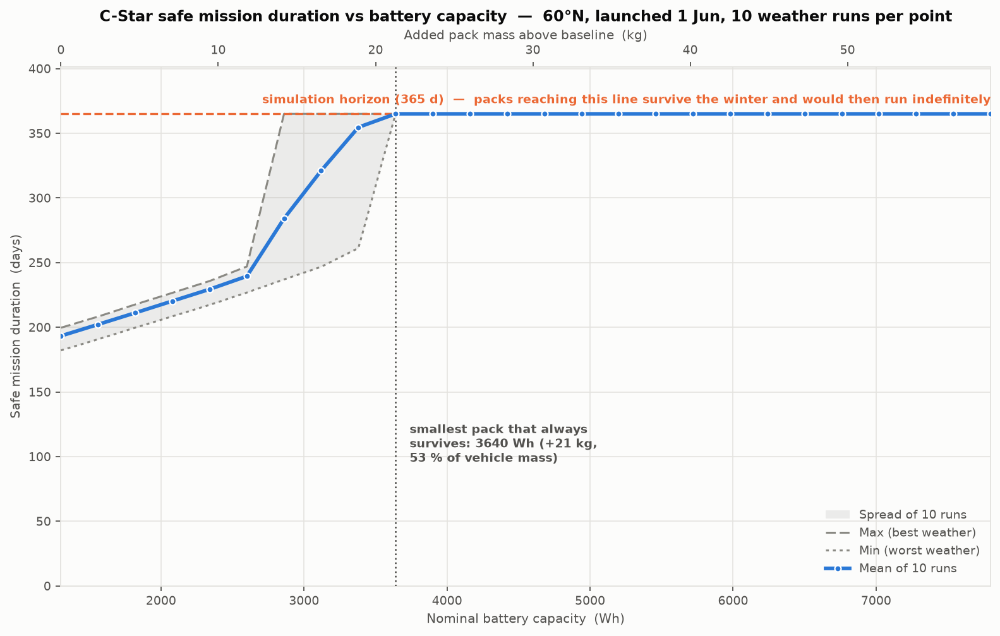
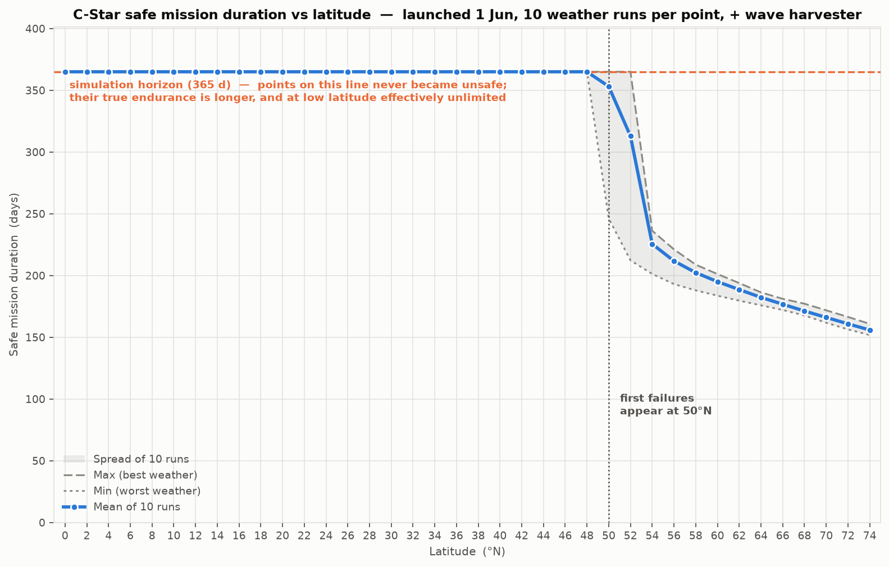
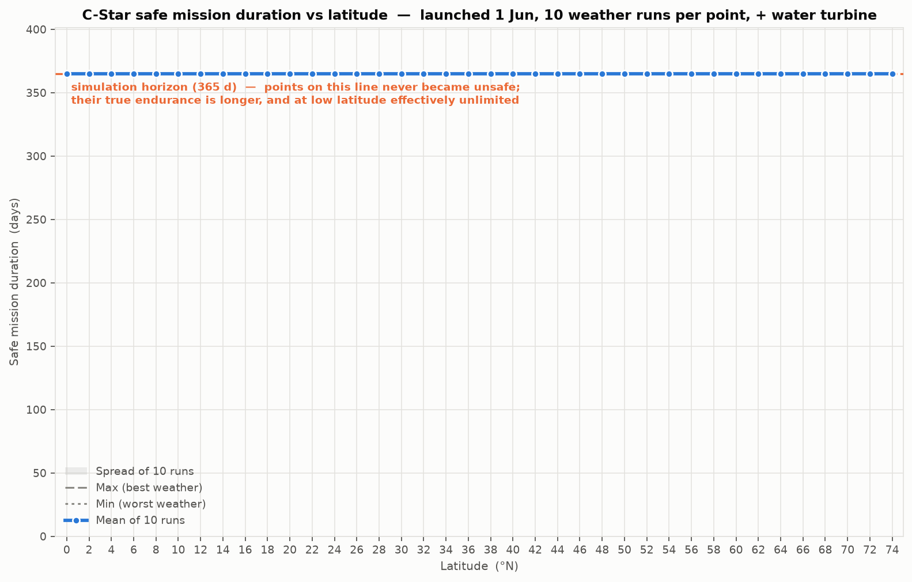

# Alternative Power for C-Star at High Latitude

**Part 1 — Sizing the problem**

---

## 1. Why build a model first

The customer's question is whether a wind turbine or a wave harvester would "meaningfully
improve endurance". That cannot be answered without first knowing how large the shortfall
is, when it occurs, and how far north it starts to bite. A harvester that delivers 2 W in
July is worthless if the deficit is in December.

I therefore built a time-domain power-budget model of the baseline vehicle before looking at
any harvester hardware. It runs an hourly energy balance over a full year and tracks battery
state of charge, taking latitude and launch date as inputs. It models solar geometry
(declination, hour angle, elevation — so day length and polar night fall out for free),
atmospheric attenuation via air mass, the cosine loss of a low sun onto a deck-mounted panel,
persistent stochastic cloud, sail shading, and a battery with temperature-dependent usable
capacity, a sub-zero charge inhibit, and calendar and cycle ageing.

The model is deliberately simple — it is a sizing tool, not a design tool. Its value is that
it converts a vague worry into a number in watts that any candidate solution must beat, and
it makes every assumption explicit and swappable. Sixteen assumptions are labelled `A1`–`A16`
in the source with a note on what it would take to firm each one up. The single most
important data gap is the cloud model (`A9`), which is currently a latitude correlation
rather than measured irradiance; replacing it with NASA POWER or PVGIS data for the
customer's actual operating box is the first thing I would do with more time.

Throughout, "safe mission duration" means the time from launch until the battery first falls
below 20 % of nominal capacity. That is not the point of failure — it is the point at which
there is no longer any reserve for a storm, a missed comms window or a bad run of weather,
and a mission planner should already be recovering the vehicle.

---

## 2. A single mission, and why no two are identical

All runs in this note assume a **1 June launch**, which is chosen deliberately rather than
arbitrarily. Three reasons:

- **It exercises a complete seasonal cycle in a single year-long run.** The vehicle meets the
  best conditions it will ever see and the worst, in that order, so one simulation captures the
  entire problem.
- **It is the most favourable possible launch date**, so any failure is a real capability limit
  rather than an artefact of bad timing. If the vehicle cannot survive a June launch, it cannot
  survive any launch, which makes every "fails" result in this note a conservative one.
- **It makes the pass/fail boundary meaningful.** A vehicle that reaches spring with charge in
  hand will recover over the following summer and can then continue indefinitely, because it
  returns to the same surplus conditions it started in. Surviving the first winter from a June
  launch therefore separates "can operate indefinitely at this latitude" from "cannot" — which
  is exactly the question the customer is asking.

The figure above shows three runs of the same vehicle at 65 °N, launched 1 June. The shape is
the whole problem in one picture. Through the northern summer the battery sits pinned near
full — the array generates far more than the vehicle can use or store, and the surplus is
simply dumped. From late September the trace begins to fall, the decline steepens through
November, and the vehicle enters the unsafe band after **175–182 days** and is flat about ten
days later.

The three traces differ because the model's cloud cover is stochastic. Cloud is generated as
an AR(1) process rather than as independent daily noise, so overcast arrives in multi-day
spells the way real weather does. That persistence matters: what threatens the vehicle is not
an averagely cloudy winter but a fortnight of unbroken overcast arriving when the sun is
already low, and a model that drew each day independently would understate that risk badly.

What is striking is how *little* the runs differ — a spread of 7 days on a 178-day mean
(σ ≈ 3.5 d). At this latitude the answer is set by orbital geometry, not by weather luck. That
is good news for mission planning, because the endurance figure is repeatable and can be
quoted with confidence. It is also bad news for optimism: there is no good year to hope for.

---

## 3. The problem is darkness, not energy

It would be easy to assume the array is simply undersized. It is not. Over a full year at
65 °N the array generates **15.0 kWh against a 8.8 kWh load — a 1.7× surplus.** The vehicle
still fails, because that energy arrives in entirely the wrong months:

| Month at 65 °N | Jul | Sep | Oct | Nov | Dec |
|---|---|---|---|---|---|
| Generation (Wh/day) | 103.7 | 40.7 | 15.6 | 2.6 | **0.1** |
| Consumption (Wh/day) | 24.0 | 24.0 | 24.0 | 24.0 | 24.0 |
| Peak sun elevation | 46° | 27° | 15° | 6° | **1.9°** |

December generation is roughly **one thousandth** of July's. Three separate penalties compound,
all of them consequences of a low sun, and it is worth separating them because they are often
conflated:

1. **Day length collapses.** Above the Arctic Circle the sun does not rise at all for part of
   the year, and well below it the useful window shrinks to a couple of hours.
2. **Cosine loss.** The panels lie flat on the deck, so the light they capture scales with the
   sine of the sun's elevation. At 1.9° that factor is 0.03 — 97 % of the available light is
   lost to geometry before any other effect is considered.
3. **Atmospheric path.** A low sun's beam crosses roughly ten atmospheres rather than one, and
   most of it is absorbed before reaching the sea surface.

Two smaller effects push the same way: high latitudes are persistently cloudier, and cold water
derates usable battery capacity by around 6 %, so the store you are drawing down is smaller than
its nameplate. (One effect works in the vehicle's favour — cold panels are about 5 % *more*
efficient than at 25 °C. It is nowhere near enough to matter.)

**This is a seasonal storage problem, not an energy problem.** That framing matters, because it
changes what a good solution looks like: the requirement is not more annual energy but a source
that delivers *during the dark months specifically*.

---

## 4. Why the margin is worth more than survival

Endurance is not the only thing at stake. C-Star also operates in driven mode, using a
propeller for station-keeping, punching through calms, holding a precise survey line, or
manoeuvring for recovery. Driven mode draws far more than the 1 W housekeeping load.

An operator will only use that capability if they can trust the vehicle to recharge afterwards.
At high latitude in winter, on the current design, they cannot — a driven-mode excursion in
November is drawn directly out of a reserve that has no way of being replenished before spring.
The practical consequence is that the vehicle is not merely at risk of dying; it is degraded to
a passive drifter precisely in the conditions where active control is most valuable.

Any additional power source should therefore be judged on two counts: whether it keeps the
vehicle alive, and whether it restores enough margin to make driven mode usable. The second is
the more demanding requirement and, commercially, probably the more valuable one.

---

## 5. Where the design stops working

Sweeping latitude from the equator northwards at 2° intervals, with ten weather realisations at
each, gives the envelope above. Launched on 1 June:

- **Up to 48 °N** every run survives the full 365-day horizon. These points sit on the dashed
  line because the simulation stopped, not because the vehicle failed — the true endurance
  there is unbounded.
- **50–52 °N is a knife edge.** At 50 °N nine of ten runs survive the year and one fails at
  239 days; at 52 °N only five of ten survive. The variance in this band is two orders of
  magnitude larger than anywhere else, and the mean is close to meaningless — the same vehicle
  either makes it through the winter or does not, depending only on the weather it happens to
  draw.
- **From 54 °N upwards every run fails**, and the curve then falls smoothly from 222 days at
  54 °N to 155 days at 74 °N.

Two features of that curve are worth drawing out. First, the fall-off is steep at the
transition and then shallow: once the vehicle is guaranteed to lose the winter, going further
north costs surprisingly little extra, because it is already generating essentially nothing
in December either way. Second, the spread between best and worst run narrows sharply with
latitude — from 34 days at 54 °N to around 9 days at 66 °N. The far north is harsher but far
more predictable.

One further lever is visible only by comparison. The same vehicle at 65 °N launched on
**1 October** survives just 61 days, against 178 days launched in June. Launch timing is worth
a factor of three in endurance and costs nothing, and it should be exhausted as a mitigation
before any hardware is considered.

**Why the sweep stops at 74 °N.** The limit is operational rather than electrical:

- **Sea ice.** Above roughly 75 °N the Arctic basin is ice-covered for most or all of the year.
  A 1 m sailing hull cannot operate in ice — it cannot make way through it, and it risks being
  beset or crushed. The Barents sector stays navigable further north thanks to the North
  Atlantic Drift, but that is a regional exception rather than a general case.
- **The model does not represent ice**, so results beyond that latitude would be misleading.
  Sea-surface temperature is floored at the freezing point of seawater and there is no ice
  physics; the model would happily report a number it has no basis to compute.
- **Ice would also invalidate the wave option specifically.** Pack ice heavily damps the wave
  field, so a wave-energy harvester loses its resource exactly where the solar deficit is
  worst — an important point when the two concepts are compared in Part 2.
- **The answer has already saturated.** December generation is effectively zero from about
  70 °N upwards, so extending the sweep adds latitude without adding information: the curve is
  flat and the physics does not change.
- **Commercial relevance.** Very little sustained commercial ocean activity takes place above
  75 °N, so the marginal value of characterising it is low relative to the effort.

Navigation is a secondary concern in the same region — magnetic heading reference degrades as
the magnetic pole is approached — but it is the ice that sets the practical boundary.

---

## 6. Summary, and the options on the table

**The problem.** The baseline C-Star is comfortably self-sufficient across most of the world's
oceans. Its solar array generates a healthy annual surplus even at 65 °N. What it cannot do is
carry energy from the summer, when it wastes most of what it collects, into the winter, when it
collects almost none. The result is a hard geographic and seasonal boundary on where the
vehicle can be deployed.

**Where there is nothing to worry about.** Below roughly 48 °N — which covers the great majority
of commercial ocean operations — no intervention is needed at all, in any season, and the
vehicle will run indefinitely. Between **50 and 52 °N** the design becomes marginal and
outcomes turn on luck; this band should be treated as requiring case-by-case assessment rather
than a blanket yes or no. **Above about 54 °N the current design cannot complete a year**, and
this is where the customer's question genuinely bites.

**The goal any solution must meet.** C-Star's value is long-duration autonomous operation, so
the target is that the vehicle should be able to survive **indefinitely** at its operating
latitude — within reason. The simulation gives a clean test for this: a vehicle that reaches
spring with charge still in hand returns to the same surplus conditions it launched in, and can
therefore keep going. Surviving the first winter is equivalent to surviving any number of them.

The bar this study applies is therefore binary rather than incremental: **a solution that cannot
carry the vehicle through the winter in simulation is insufficient, however much it improves the
numbers.** Extending endurance from 193 to 250 days does not solve the customer's problem, it
defers it by two months and still ends with a dead vehicle in the water. "Within reason"
acknowledges that other mechanisms — biofouling, calendar ageing of the cells, mechanical wear
on the wingsail and rudder — impose their own limits, but those are measured in years and are a
separate question from the seasonal energy balance considered here.

**The two options in the brief.** A **small wind turbine** is attractive because the high-latitude
winter that removes the sun is also windy, so supply and demand are seasonally in phase; the
questions are how much power is available at the scale of a 1 m, 40 kg sailing hull, and what
it costs in drag, mass aloft and reliability. A **wave-energy harvester** shares the same
favourable seasonal correlation — winter seas are the biggest — and has no exposed rotating
machinery above the waterline, but extracting useful power from the motion of a very small hull
is a harder physical problem. Both are assessed in Part 2 against the requirement derived here.

**Other options considered for completeness.** Any recommendation has to beat the boring
alternatives, so two further options are carried through the comparison: simply fitting a
**larger battery**, which needs no new technology but costs mass on a 40 kg vehicle; and
**re-using the existing propeller as a water turbine** while under sail, which adds no new
external hardware at all and exploits the fact that the vehicle is already moving through the
water for most of its mission.

**Assumptions bounding this study.** Two obvious levers are excluded by assumption, and both
should be confirmed with Oshen before the study is relied upon:

- **No additional solar area is available.** The deck and wingsail are assumed to be fully
  utilised at 50 W peak. If usable area does exist — particularly on near-vertical surfaces,
  which perform far better than a flat deck under a low sun — that would change the analysis
  substantially and should be checked first.
- **Average electrical consumption cannot be reduced below 1 W.** Given that the deficit is
  measured in tenths of a watt, even a modest saving in winter duty cycle would be a
  disproportionately effective mitigation, so this assumption is worth challenging directly.

---

# Part 2 — Assessing the options

## 7. A larger battery

The simplest option is to fit more cells. It carries no technology risk, adds no external
hardware, no drag, no moving parts and no new failure modes, and it can be done today. Any
harvester proposal has to beat it, so it is assessed first.

Sweeping nominal capacity from the 1300 Wh baseline upwards at 60 °N, with ten weather runs at
each point, gives two clear findings.

**Below the survival threshold, capacity buys endurance linearly** — 3.9 days per kilogram of
cells, or 35 days per 1000 Wh, with a linear fit of R² = 0.9996. There is no efficiency argument
against a bigger battery: every watt-hour installed pulls its weight. This is worth stating
plainly, because the intuition that returns must diminish is wrong here.

**But the useful quantity is not days, it is the threshold.** Against the indefinite-survival
goal set out above, a pack that extends the mission without reaching spring is worthless — it
delivers a vehicle that dies later. The number that matters is the smallest pack that clears the
winter, and it scales badly with latitude:

| Latitude | Baseline duration | Pack needed to survive | Added mass | As % of 40 kg vehicle |
|---|---|---|---|---|
| 60 °N | 193 d | 3640 Wh (2.8×) | +21.3 kg | **53 %** |
| 65 °N | 178 d | 4680 Wh (3.6×) | +30.7 kg | **77 %** |
| 70 °N | 165 d | 6500 Wh (5.0×) | +47.3 kg | **118 %** |

At 60 °N the required battery is over half the mass of the entire vehicle. At 70 °N **the cells
alone would weigh more than the complete C-Star.** This is no longer a modification; it is a
different vehicle, with different displacement, freeboard, righting moment, sail-area-to-mass
ratio, payload capacity and handling characteristics — and it would need to be re-designed and
re-qualified from the hull outwards.

There is a further trap in the transition. Between 2860 and 3380 Wh at 60 °N the vehicle is in a
**marginal band where some weather years survive and some do not**. Sizing anywhere in that band
buys a coin toss, and because the failure mode is a dead vehicle in a remote ocean in winter,
that is not an acceptable design point. The pack must be sized past the band, not into it.

**Verdict.** A larger battery is technically sound and carries essentially no development risk,
and it is the right answer for the marginal 50–52 °N band, where a modest increase would convert
an uncertain outcome into a reliable one. Above roughly 60 °N it fails — not on physics, but on
mass. It also does nothing for the driven-mode margin discussed in §4, because it adds no
generation: it enlarges the tank without addressing the fact that nothing is filling it in
December. It is therefore carried forward as the benchmark that the wind and wave concepts must
beat, rather than as a recommendation in its own right.

---

*Supporting work: `cstar_power_model.py` (the model, with assumptions `A1`–`A16` documented
inline), `run_mission.py` (single-mission runs), `sweep_latitude.py` (the latitude envelope),
`sweep_battery.py` (the capacity study in §7).*

## 8. A micro wind turbine

**The concept.** A small horizontal-axis rotor, 0.20 m diameter, mounted clear of the wingsail's
rotation. Modelled as `P = ½ρACpηv³` with a 3 m/s cut-in, a 12 W electrical rating and furling
above 25 m/s for survival.

**How it is modelled.** Wind is generated as a daily AR(1) series so gales and calms persist for
days, with a latitude- and season-dependent mean (`A17`): roughly 6.5 m/s at the equator rising to
~11 m/s at 60°, and **peaking in midwinter** — in direct antiphase with the sun. The series is
corrected from the 10 m reference height down to a ~1 m hub (`A18`), which costs about 22 %. The
cubic is evaluated on the hourly distribution rather than on the mean, which matters greatly:
E[v³] is roughly twice E[v]³ for a realistic wind distribution.

**Result: it works, with a large margin.** Mean output is **2.6 W at 60 °N, 3.1 W at 70 °N** —
five to ten times the 0.25–0.5 W requirement derived in Part 1, and 2–3× the entire vehicle load.

Every run survives the full year **up to 68 °N**, against 48 °N for solar alone. Between 70 and
74 °N it becomes marginal — not because the wind fails but because the turbine ices, furls, or
sits in a winter calm at the exact moment there is no solar backstop at all.

**Blockers.** The physics is the easy part; the integration is not. A rotating machine at the
masthead of a vehicle whose *entire propulsion system is a rotating wingsail* is a serious
geometric and aerodynamic conflict — it disturbs the sail's flow and competes for the one
location with clean air. It puts mass and windage high, directly attacking righting moment on a
40 kg hull. It adds the first exposed moving bearing on the vehicle, in salt spray, unattended,
for a year. And it must survive knockdown and full immersion. **Icing at the latitudes where it
is most needed is the single largest unquantified risk.**

## 9. An inertial wave-energy harvester

**The concept.** A proof mass moving inside the hull, reacting against the hull's wave-driven
motion, with a linear or rotary power take-off.

**How it is modelled.** A 1 m hull is far shorter than an ocean wavelength (50–150 m), so it is a
**wave follower** — it rides the surface rather than moving relative to it (`A21`). There is
therefore no hull-to-water relative motion to exploit, and the only energy available comes from
the hull's own vertical acceleration acting on an internal mass:

`ω = 2π/Te`,  `a = ω²·Hs/2`,  `E ≈ 2·m·a·s` per half cycle,  `P = E·(2/Te)·η`

with a 2 kg proof mass, 60 mm of usable stroke, and 50 % PTO efficiency. Significant wave height
is tied to the same wind series (`A20`), so gales bring wind and waves together.

**Result: it falls two orders of magnitude short.** Mean output is **0.023 W** — about 2 % of the
vehicle load, and roughly one-twentieth of the 0.48 W needed at 70 °N.

The curve is **indistinguishable from solar alone**: survival still ends at 48 °N. Adding this
harvester changes nothing.

**Why, and what would change it.** Power is directly proportional to stroke, and a 1 m hull
simply has no stroke to give. Reaching 0.5 W would need roughly a 20-fold increase in the
mass–stroke product — a 5 kg mass moving 0.5 m inside a 1 m vehicle, which is not physically
available. **This is a scale problem, not an engineering-maturity problem**, and no amount of PTO
refinement recovers a factor of twenty. Wave energy is credible on larger platforms; on C-Star it
is not.

## 10. Propeller regeneration (water turbine)

**The concept.** No new external hardware at all: let the **existing propeller** freewheel while
the vehicle is under sail, and run the existing motor as a generator.

**How it is modelled.** Identical turbine physics to the wind case but in water — `ρ = 1025`
rather than 1.225, an 830-fold density advantage. A 0.10 m disc, Cp 0.25 (a propeller is a poor
turbine), 60 % drivetrain efficiency. Boat speed is derived from the same wind series and capped
at displacement hull speed for a 1 m waterline, ~1.25 m/s (`A23`).

**Result: it works, and it works furthest north.** Mean output is **1.0 W at 60 °N, 1.07 W at
70 °N** — two to four times the requirement.

**Every run survives the full year across the entire swept range, to 74 °N** — the only option
tested that does so.

**Why it outperforms wind despite being smaller.** The density ratio. A 0.10 m disc at 1 m/s of
water beats a 0.20 m rotor in 5 m/s of air. And because boat speed rises with wind, it carries the
same favourable winter phasing as the turbine while adding no windage and no new external parts.

**Blockers.** The cost is **drag**. Extracting 1 W at 1 m/s demands at least 1 N of thrust deficit
against a hull drag of perhaps 2–5 N, so a 20–50 % drag penalty and a rough 5–10 % speed loss —
which compounds, since a slower boat generates less. This must be traded against passage time and
VMG, and the turbine should almost certainly be **clutched out when the battery is full or when
making passage matters**. Secondary concerns: the motor and drivetrain must tolerate a year of
continuous reverse-driven rotation; the propeller becomes a permanent fouling and weed-catching
site; and the motor controller must support regeneration.

---

# Part 3 — Comparison, testing and recommendation

## 11. The options side by side

All figures at a 1 June launch, ten weather runs per point, against a requirement of 0.25 W at
65 °N and 0.48 W at 70 °N.

| Option | Mean output | Survives to | Added mass | Verdict |
|---|---|---|---|---|
| Solar only (baseline) | — | 48 °N | — | Fails above ~54 °N |
| Larger battery | — | 60 °N needs 2.8× pack | **+21 to +47 kg** | Fails on mass |
| **Wind turbine** | 2.6–3.1 W | **68 °N** | ~1–2 kg, high up | Works; hard to integrate |
| Wave harvester | 0.023 W | 48 °N | ~2–3 kg | **Fails by ~20×** |
| **Propeller regen** | 1.0–1.1 W | **74 °N+** | **~0 kg** | Works; costs drag |

Three conclusions follow directly:

1. **Wave energy is not viable at this scale** and should be closed out. It is a scale problem,
   not a maturity problem.
2. **The larger battery is not a solution above 60 °N**, only a mitigation for the marginal
   50–52 °N band.
3. **Both turbine options clear the requirement with margin.** The choice between them is not
   about power — it is about integration risk, and on that basis propeller regeneration is
   clearly ahead.

## 12. Recommendation

**Pursue propeller regeneration first.** It is the only option that survives the full swept range
to 74 °N, it adds no external hardware, no windage and essentially no mass, and it re-uses parts
already on the vehicle and already qualified. Its risk is a drag penalty that is measurable in a
tow tank in days, and controllable in software by clutching out when not needed. It also directly
addresses the driven-mode margin of §4: the same drivetrain both consumes and regenerates.

**Carry the wind turbine as the backup.** It produces the most power and would extend the vehicle
furthest if the drag penalty proves unacceptable, but it conflicts geometrically with the
wingsail, raises the centre of gravity on a 40 kg hull, and introduces the vehicle's first
exposed rotating bearing. Those are real programme risks, not detail design.

**Close out wave energy now** and say so plainly to the customer. Continuing to study it would
consume budget on a factor-of-twenty gap that no refinement closes.

## 13. How I would de-risk this before spending significantly

Cheapest and most decisive tests first. Each is designed to **kill** the concept if it is going to
fail.

1. **Fix the input data (days, ~£0).** Replace the synthetic cloud and wind climatology (`A9`,
   `A17`, `A20`) with ERA5 / NASA POWER reanalysis for the customer's actual operating box, and
   re-run. Every number in this note moves; nothing else should be funded until this is done.
2. **Instrument an existing hull (weeks, low cost).** Log an IMU, a GPS speed trace and panel
   current on a C-Star already going to sea. This simultaneously measures the real acceleration
   spectrum (killing or confirming wave in one step), the real speed distribution that sets water
   turbine output, and the real solar shading loss — three assumptions retired for the cost of one
   deployment.
3. **Bench-test regeneration (~2 weeks).** Spin the existing motor and controller as a generator
   at representative rpm; measure electrical output and mechanical torque. Confirms both power and
   the drag penalty on a bench before anything gets wet.
4. **Tow-tank the drag trade (~2 weeks).** Measure hull drag with the propeller clutched in and
   out at 0.5–1.5 m/s. This is the single number that decides the recommendation.
5. **Sea trial with a data logger, not a mission (~1 month).** Fit regeneration to one vehicle,
   log everything, and fly a route where failure is recoverable. Do not commit a customer mission
   until a full seasonal dataset exists.

## 14. Two months versus six months

**With two months**, the goal is a *decision*, not a prototype. I would do steps 1–4 above and
build a lash-up: existing vehicle, existing motor, a regeneration-capable controller and a data
logger, tested in a tank and then in sheltered water. The deliverable is a defensible answer to
"does the drag penalty kill this?" and a measured power curve. I would not attempt the wind
turbine in two months — the wingsail interaction alone needs CFD or wind-tunnel time, and a
rushed masthead installation would test the mounting rather than the concept. Scope is protected
by accepting a non-flight-representative build.

**With six months**, the same first two months run unchanged — the tests above are the critical
path either way and their value does not scale with schedule. The extra four months buy: a
flight-representative clutched regeneration drive with proper sealing and bearing life testing; a
parallel wind turbine feasibility strand taken far enough to compare fairly (mounting geometry,
sail interaction, icing exposure); a full winter deployment at 60 °N+ to validate the model
against reality rather than against reanalysis; and re-qualification of the vehicle with the
modified drivetrain. The deliverable is a prototype Oshen could sell a mission on, rather than an
answer to a question.

The distinction matters because **the two-month plan is not a compressed six-month plan.** It
deliberately drops the wind strand, accepts a non-representative build, and buys a decision rather
than a product. Attempting the six-month scope in two months would produce a prototype that fails
for integration reasons and would tell us nothing about whether the concept was sound.

## 15. Assumptions and what would firm them up

All model assumptions are labelled `A1`–`A23` inline in `cstar_power_model.py`, each with a
"TO FIRM UP" note. The five that most affect the conclusions:

| # | Assumption | Why it matters | To firm up |
|---|---|---|---|
| `A9` | Cloud from a latitude correlation | Sets the whole solar deficit | ERA5 / PVGIS for the real operating box |
| `A17` | Wind climatology and its winter peak | The entire case for wind and water | ERA5 reanalysis |
| `A21` | Wave harvester stroke and proof mass | Decides a 20× shortfall | IMU on a real hull at sea |
| `A23` | Boat speed from wind speed | Water turbine scales with v³ | GPS traces from existing missions |
| `A2` | Panels horizontal on deck | Low-sun cosine loss is punishing | CAD; check for usable vertical area |

Two further assumptions bound the study and should be confirmed with Oshen: that **no additional
solar area is available**, and that **average consumption cannot be reduced below 1 W**. Given
that the deficit is measured in tenths of a watt, both are disproportionately powerful levers, and
a winter duty-cycle reduction may be cheaper than any hardware considered here.
